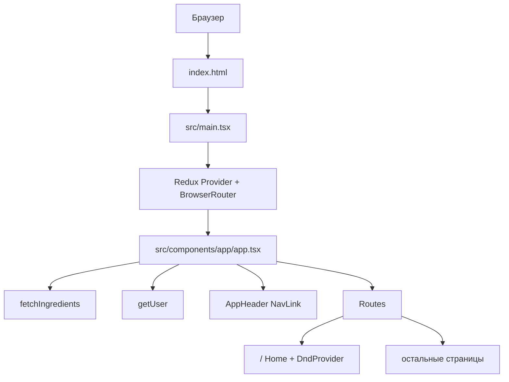
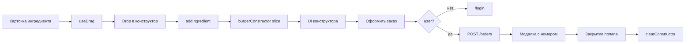
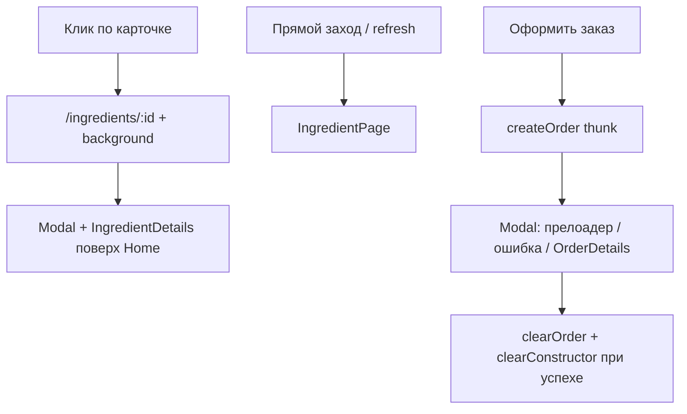
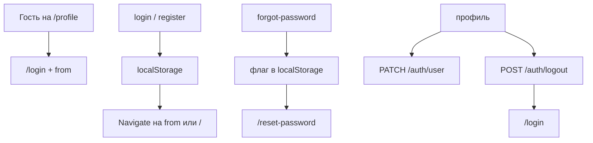

# Обзор проекта

Stellar Burgers — клиентское React-приложение для сборки бургера и оформления заказа.
Учебный проект курса «Middle Front-end + React-разработчик».
Реализованы спринты 1–3. Собирается как Vite SPA.

> Схема: [`project-overview.svg`](./project-overview.svg)

Брифы заданий: [спринт 1](./checklist-1.md), [спринт 2](./sprint2.md), [спринт 3](./sprint3.md). Чек-листы: [2](./checklist-2.md), [3](./checklist-3.md). Архитектура: [`project-architecture.md`](./project-architecture.md).

## Что делает приложение

- Загружает ингредиенты из Norma API (`GET /ingredients`).
- Показывает каталог с вкладками «Булки / Соусы / Начинки» и подсветкой ближайшего заголовка при скролле.
- Позволяет собрать бургер drag-and-drop: булка заменяется, начинки добавляются, сортируются и удаляются.
- Считает стоимость и счётчики на карточках мемоизированными селекторами.
- Оформляет заказ (`POST /orders` с `authorization`) только у авторизованного пользователя и показывает номер в модалке.
- После закрытия попапа с номером очищает конструктор.
- Маршрутизирует экраны через `BrowserRouter`: главная, ингредиент, auth-формы, профиль, заглушки ленты и 404.
- Хранит JWT в `localStorage`, обновляет access-токен через `fetchWithRefresh`.

Пока не сделано: живая лента заказов, история заказов пользователя, WebSocket, SSR.

## Верхнеуровневая структура

```text
.
├── docs/                     # Задания, чек-листы, обзор и схемы
├── public/                   # Статические файлы Vite
├── src/
│   ├── components/           # UI: шапка, конструктор, модалки, ProtectedRoute
│   ├── pages/                # Страницы маршрутов
│   ├── services/             # Redux: store, слайсы, thunks, хуки
│   └── utils/                # API, auth storage, константы, типы, DnD
├── index.html                # HTML-оболочка, узел #modals
├── vite.config.ts            # Vite, алиасы, Vitest, base для GH Pages
└── package.json              # Скрипты и зависимости
```

## Поток запуска



## Основные пользовательские потоки

### Конструктор бургера



### Ингредиент и модалки



### Auth и профиль



## Источники данных

| Источник | Для чего используется | Основные файлы |
| --- | --- | --- |
| REST API | Ингредиенты, заказ, register/login/logout/token/user, сброс пароля | `src/utils/burger-api.ts`, `src/utils/constants.ts` |
| localStorage | `accessToken`, `refreshToken`, флаг reset-password | `src/utils/auth.ts` |
| Redux store | Auth, ингредиенты, конструктор, текущий ингредиент, заказ | `src/services/store.ts`, слайсы в `src/services/*` |
| React Router | Экраны, модальный фон ингредиента, protected routes | `src/main.tsx`, `src/components/app/app.tsx` |
| React DnD | Перетаскивание в конструктор и сортировка начинок | `src/utils/dnd.ts`, `src/pages/home/home.tsx` |

## Важные замечания по текущей реализации

- CSR SPA. `BrowserRouter` + `basename` из `BASE_URL` (на GH Pages это `/react-burger-ts`).
- Заказ только с авторизацией. Тело: `[bunId, ...fillingIds, bunId]`.
- `fetchWithRefresh`: при `jwt expired` — `POST /auth/token`, повтор исходного запроса.
- Redux DevTools включены только в `import.meta.env.DEV`.
- `/feed` и `/profile/orders` — заглушки до спринта с WebSocket.
- Деплой на GitHub Pages: https://kirillchistov.github.io/react-burger-ts/

## Спринты

### Спринт 1

- [x] Список ингредиентов с сервера, прелоадер и обработка ошибок
- [x] Конструктор, стоимость, кастомный скролл
- [x] Модалки ингредиента и заказа (портал, Esc, оверлей)

### Спринт 2

- [x] Табы ингредиентов, Redux, заказ, DnD, счётчики и цена

### Спринт 3

- [x] Роутинг, страница и модалка ингредиента
- [x] Вёрстка login/register/forgot/reset/profile/feed/404
- [x] Auth API, `ProtectedRoute`, профиль save/cancel, заказ только с токеном
